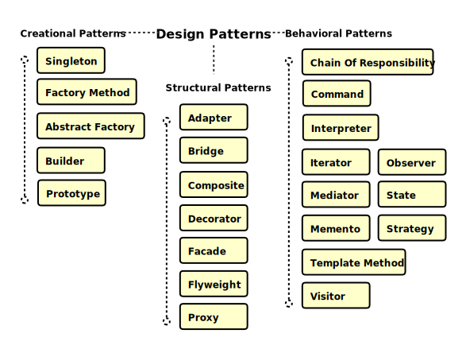

# Design Patterns

设计模式

## Creational Patterns

创建模式

* Singleton 
  * 单例模式
  * 保证一个类仅有一个实例
* Factory Method
  * 工厂模式
  * 让其子类自己决定实例化哪一个工厂类       
* Abstract Factory
  * 抽象工厂模式
  * 创建一系列相关或相互依赖对象的接口，而无需指定它们具体的类
* Builder
  * 建造者模式
  * 使用多个简单的对象一步一步构建成一个复杂的对象
* Prototype
  * 原型模式
  * 创建重复的对象  
  
##  Structural Patterns

结构模式

| Patterns  | 模式   | 描述 |
| :-------- | :----- | :--- |
| Adapter   | 适配器 |      |
| Bridge    | 桥接   |      |
| Composite | 组合   |      |
| Decorator | 装饰   |      |
| Facade    | 外观   |      |
| Flyweight | 享元   |      |
| Proxy     | 代理   |      |

* Adapter  
* Bridge   
* Composite
* Decorator
* Facade   
* Flyweight 
* Proxy    
##  Behavioral Patterns

行为模式

| Patterns                | 模式     |                                                                  |
| :---------------------- | :------- | :--------------------------------------------------------------- |
| Chain Of Responsibility | 职责链   |                                                                  |
| Command                 | 命令     |                                                                  |
| Interpreter             | 解释器   |                                                                  |
| Iterator                | 迭代器   |                                                                  |
| Mediator                | 中介者   |                                                                  |
| Memento                 | 备忘录   |                                                                  |
| Observer                | 观察者   |                                                                  |
| State                   | 状态     |                                                                  |
| Strategy                | 策略     | 定义一系列的算法，把它们一个个封装起来，并且使它们可以相互替换。 |
| Template Method         | 模板方法 |                                                                  |
| Visitor                 | 访问者   |                                                                  |

* Chain Of Responsibility
* Command
* Interpreter
* Iterator
* Mediator
* Memento
* Observer
* State
* Strategy
* Template Method
* Visitor